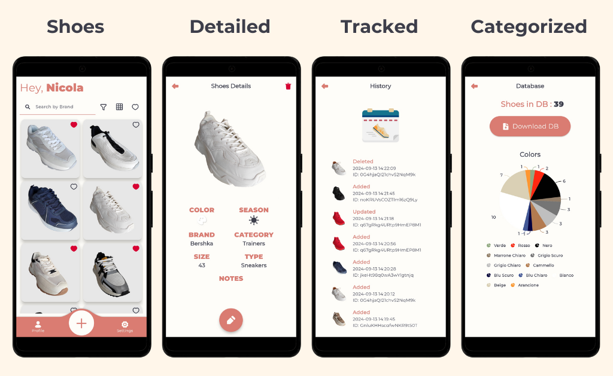

# Shox
> <b>Author: Nicola De Nicolais</b>
## 💎 Preview

## 📄 Description
This application allows you to create a digital wardrobe where you can save and view all your Shoes. In this way all your shoes will be cataloged and always at your fingertips.

Features

- The organization of shoes by color, brand, category and type allowing users to quickly search and filter through the available options.
- The app allows users to add shoes to their favorites, making it easy to filter and view only their preferred items.
- The home page shows all the shoes added by the user, with options to filter and display them according to the parameters chosen. The user can also choose to view the shoes in three different views: grid, mosaic and list.
- A search feature that allows users to find shoes by typing the brand name. Alternatively, users can use the filter panel to narrow down results by color, season, category, or type.
- A feature that allows users to edit and crop the shoes photos before saving them.
- A history of all operations performed within the app so you can remember when you have added, updated or deleted a shoes.
- Pie charts showing the distribution of your shoes by color, brand, category and type.
- The option to download a PDF document that contains detailed information from the database. Each page of the document is dedicated to a single pair of shoes, displaying all relevant details.
- The layout of the app adapts to the screen on which the device is opened, differing the size of the UI based on smartphone or tablet.
- The user can choose the app's language from 5 different options, ensuring a personalized experience. The available languages are: English, Italian, French, Spanish, and German.
- The user can switch between light and dark theme. Also the app detects the system theme of theme at startup and starts with that.
- Users can access the app via Google or by registering with an email and password. Each user has their own database, utilizing Cloud Firestore and Firebase Storage, and there is an option to delete it if desired.

## 🎨 Screenshots

## 📌 Dependencies
- [cloud_firestore](https://pub.dev/packages/cloud_firestore)
- [firebase_storage](https://pub.dev/packages/firebase_storage)
- [GetX](https://pub.dev/packages/get)
- [provider](https://pub.dev/packages/provider)
- [convex_bottom_bar](https://pub.dev/packages/convex_bottom_bar)
- [delightful_toast](https://pub.dev/packages/delightful_toast)
- [image_picker](https://pub.dev/packages/image_picker)
- [image_cropper](https://pub.dev/packages/image_cropper)
- [syncfusion_flutter_charts](https://pub.dev/packages/syncfusion_flutter_charts)
- [smooth_page_indicator](https://pub.dev/packages/smooth_page_indicator)
- [flutter_screen_util](https://pub.dev/packages/flutter_screenutil)
- [flutter_localization](https://pub.dev/packages/flutter_localization)
- [webview_flutter](https://pub.dev/packages/webview_flutter)
- [intl](https://pub.dev/packages/intl)

