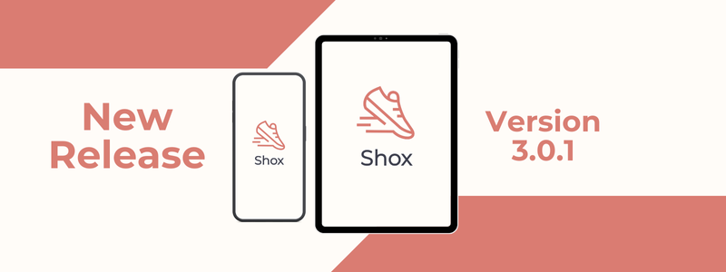
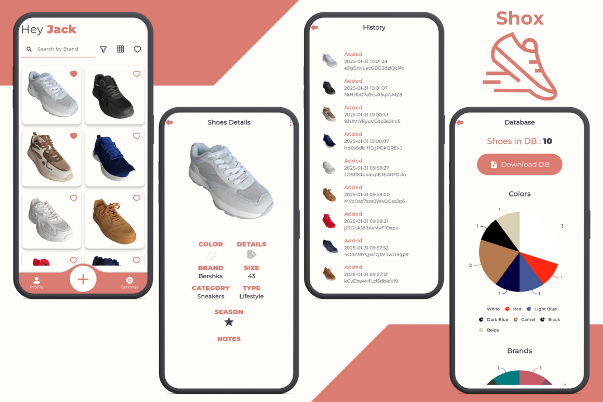

## Authors
- [@ndn21](https://github.com/ndenicolais)

## 📄 Description

This application allows you to create a digital wardrobe where you can save and view all your Shoes. In this way all your shoes will be cataloged and always at your fingertips.

## 💎 Release

The release of version 3.0.0 of the application is now available for download. You can download it from the following link:

[Download v3.0.0](https://github.com/ndenicolais/Shox/releases/download/v3.0.0/Shox_v3.0.0.apk)

## 🔑 Features
- Users can access the app via Google or by registering with an email and password
- Data storage with Firestore Database
- Image storage with Supabase Storage
- Navigation with transition effects using get
- The organization of shoes by colors, brand, category and type allowing users to quickly search and filter through the available options
- The app allows users to add shoes to their favorites, making it easy to filter and view only their preferred items
- Home shows all the shoes added by the user, with options to filter and display the shoes in three different views: grid, mosaic and list
- A search feature that allows users to find shoes by typing the brand name, and also by color, season, category, or type
- A feature that allows users to edit and crop the shoes photos before saving them
- A history of all operations performed within the app so you can remember when you have added, updated or deleted a shoes
- Pie charts showing the distribution of your shoes by color, brand, category and type
- PDF document that contains detailed information from the database. Each page of the document is dedicated to a single pair of shoes, displaying all details
- The layout of the app adapts to the screen on which the device is opened, differing the size of the UI based on smartphone or tablet
- Light and dark theme variants
- English, Italian, French, Spanish, and German languages variants

## 🎨 Screenshots

## 📌 Packages
Below is a list of some of the most relevant packages:
- [get](https://pub.dev/packages/get)
- [flutter_screenutil](https://pub.dev/packages/flutter_screenutil)
- [google_fonts](https://pub.dev/packages/google_fonts)
- [cloud_firestore](https://pub.dev/packages/cloud_firestore)
- [supabase_flutter](https://pub.dev/packages/supabase_flutter)
- [intl](https://pub.dev/packages/intl)
- [shared_preferences](https://pub.dev/packages/shared_preferences)
- [convex_bottom_bar](https://pub.dev/packages/convex_bottom_bar)
- [syncfusion_flutter_charts](https://pub.dev/packages/syncfusion_flutter_charts)
