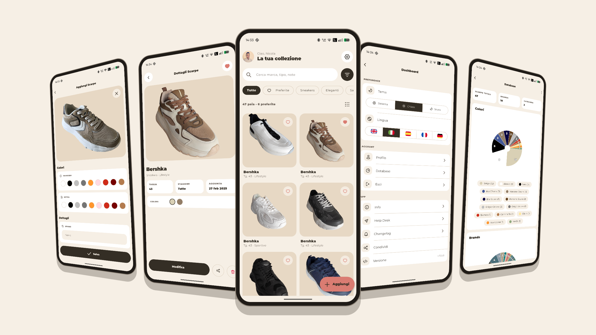
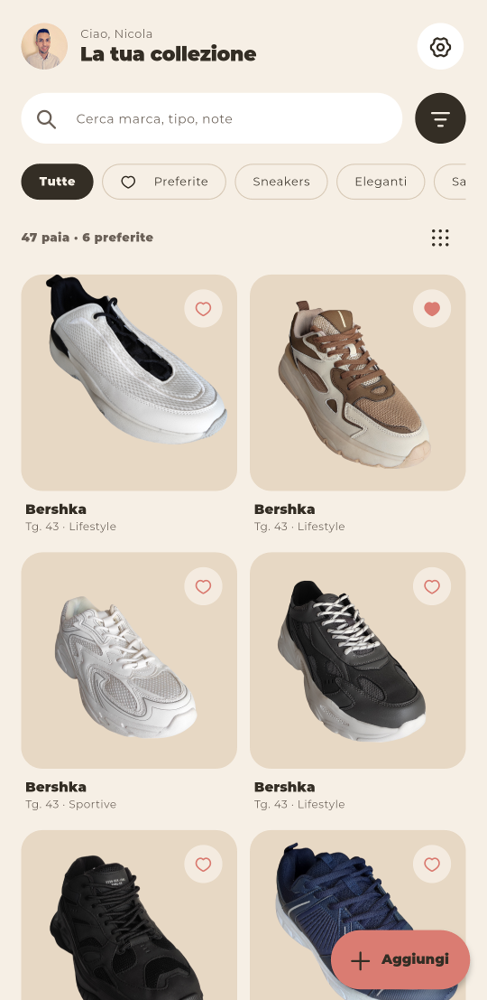
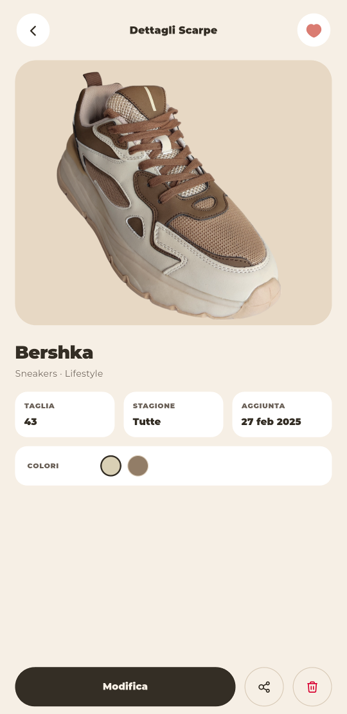
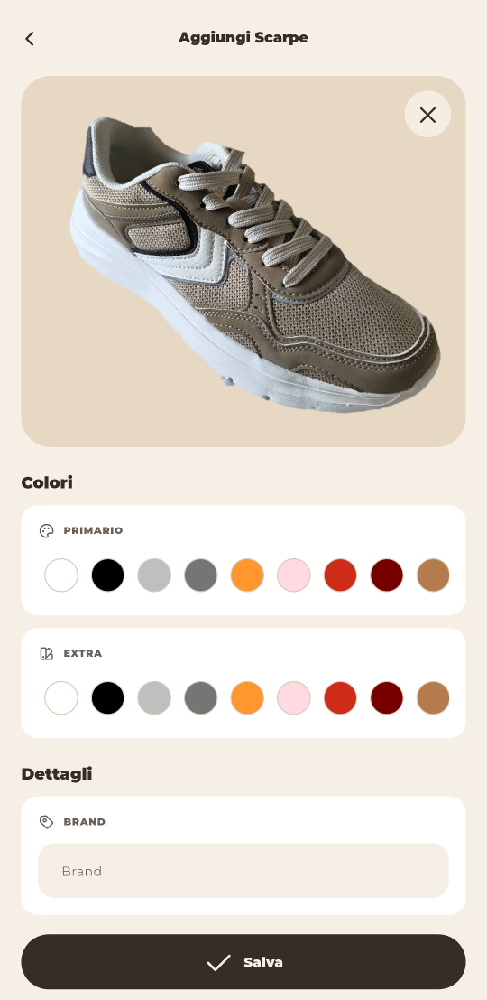
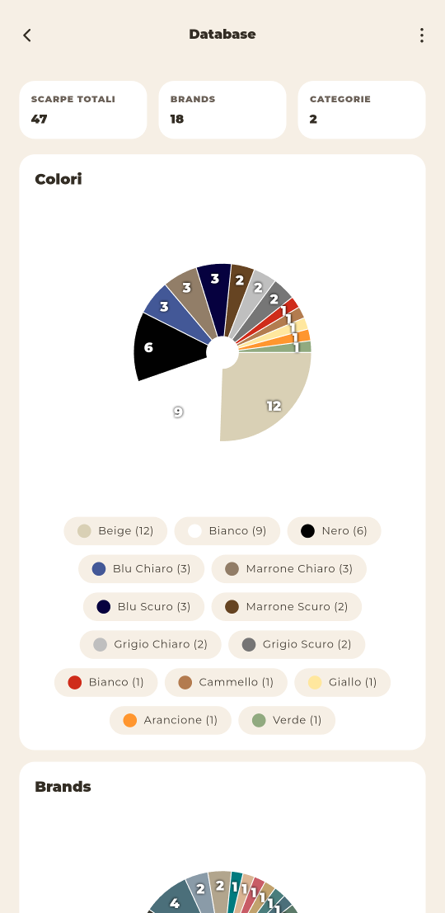
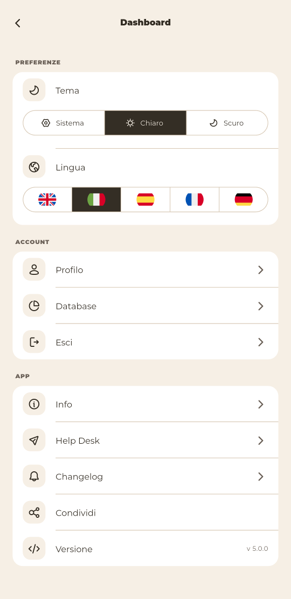

<div align="center">


# Shox

**A digital shoe wardrobe for Android, built with Flutter.**

Catalogue your whole shoe collection with real-time cloud sync, advanced filters,<br>
visual statistics, PDF export and JSON backup — in 5 languages, with light and dark themes.

[](https://github.com/ndenicolais/Shox/releases/latest)
[](#requirements)
[](https://flutter.dev)
[](LICENSE.md)

[**📥 Download the APK**](#download) · [Features](#features) · [Documentation](DOCUMENTATION.md) · [Privacy](PRIVACY.md)

<br>



</div>

---

## Screenshots

| Collection | Details | Add shoe | Statistics | Dashboard |
|:---:|:---:|:---:|:---:|:---:|
|  |  |  |  |  |

---

## Features

| | |
|---|---|
| 👟 **Collection** | Add, view, edit and delete your shoes with photo, brand, size, category, type, season and colors |
| 🔍 **Advanced filters** | Filter by category, type, season, primary color, extra color or favorites, and search by brand, type, category or notes |
| ❤️ **Favorites** | Mark your favorite shoes and find them quickly |
| 📸 **Images** | Camera or gallery, with cropping, automatic compression and on-device background removal (Google ML Kit) |
| 📊 **Statistics** | Interactive pie charts by color, brand, category and type |
| 📄 **PDF export** | A full PDF catalogue with cover, user profile and a page for each shoe |
| 💾 **JSON backup** | Export and import the whole collection as JSON |
| 📤 **Sharing** | Share a shoe card as a screenshot or save its photo to the gallery |
| 🔐 **Authentication** | Sign in with a Google account or email and password |
| ☁️ **Sync** | Real-time data on Cloud Firestore and images on Firebase Storage |
| 🌍 **Multilingual** | Italian, English, French, Spanish and German |
| 🌗 **Theme** | System / Light / Dark theme with Material 3 design |
| 📱 **Adaptive layout** | Content that actually reorganizes (not just scales) on phones and tablets, with free screen rotation |

---

## Download

<a href="https://github.com/ndenicolais/Shox/releases/download/v5.0.0/Shox_v5.0.0.apk"></a>

Shox is distributed as an APK on [GitHub Releases](https://github.com/ndenicolais/Shox/releases), not on the Play Store. It needs Android 7.0+ on a 64-bit (arm64) device with Google Play services.

1. Download the APK on your phone and open it.
2. If asked, allow your browser or file manager to **install unknown apps**.
3. Confirm the installation.

> [!NOTE]
> **"App blocked to protect your device" (Google Play Protect).** Play Protect shows this warning for apps that are not distributed through the Play Store and whose developer it does not know yet. Tap **More details → Install anyway** to continue. The source code of every release is available in this repository.

> [!IMPORTANT]
> **Updating from Shox 4.x (or a 5.0.0 APK downloaded before October 2, 2026):** releases are now signed with a new key, so Android cannot update the old app in place. Uninstall the previous version first, then install the new APK. Your collection is stored in the cloud and comes back as soon as you sign in.

---

## Architecture

| Layer | Technology |
|---|---|
| Framework | Flutter 3 / Dart |
| State management | GetX |
| Cloud database | Cloud Firestore |
| Image storage | Firebase Storage |
| Authentication | Firebase Auth + Google Sign In |
| Local persistence | SharedPreferences |
| Responsive UI | flutter_screenutil |
| Fonts | Montserrat (bundled) |
| Icons | MingCute Icons |
| Charts | fl_chart |
| Images | image_picker, image_cropper, flutter_image_compress, google_mlkit_subject_segmentation |
| Export | pdf, share_plus, image_gallery_saver_plus |

<details>
<summary><b>Project structure</b></summary>

```
lib/
├── main.dart                  # Entry point
├── common/                    # Shared screens (intro, onboarding, welcome) and global widgets
├── core/                      # GetX routes, constants, services and utilities
├── features/                  # Feature modules
│   ├── auth/                  # Authentication (login, signup, reset password, gender selection)
│   ├── dashboard/             # Dashboard (settings, account, info, privacy, support)
│   ├── database/              # Statistics, PDF export, JSON export/import
│   ├── home/                  # Shoe list with filters and search
│   ├── shoes/                 # Shoe CRUD
│   └── users/                 # User profile
├── l10n/                      # ARB localization files (en, it, fr, es, de)
└── theme/                     # Theme, colors, spacing and theme controller
```

</details>

---

## Build from source

### Requirements

- Flutter SDK 3.44 or later (stable channel)
- Dart SDK 3.12 or later (bundled with Flutter)
- Android 7.0+ (API 24+), 64-bit (arm64), with Google Play services
- Internet connection (for authentication and Firestore sync)
- A configured `android/app/google-services.json` file

### Run

```bash
# Clone the repository
git clone https://github.com/ndenicolais/Shox.git
cd Shox

# Install dependencies
flutter pub get

# Run the app
flutter run
```

Release builds are signed with the keystore set in `android/key.properties` (see [DOCUMENTATION.md](DOCUMENTATION.md#13-build-and-distribution)); without it, they fall back to the debug key.

---

## Documentation

For detailed documentation of every feature, data model, screen and technical choice, see [DOCUMENTATION.md](DOCUMENTATION.md). How personal data is handled is described in the [privacy policy](PRIVACY.md).

---

## License

Copyright © 2025–2026 Nicola De Nicolais.
Released under the **MIT** license — see [LICENSE.md](LICENSE.md) for details.

<div align="center">

Made by **Nicola De Nicolais** · [ndn21dev@gmail.com](mailto:ndn21dev@gmail.com) · [GitHub](https://github.com/ndenicolais)

</div>
